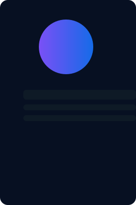
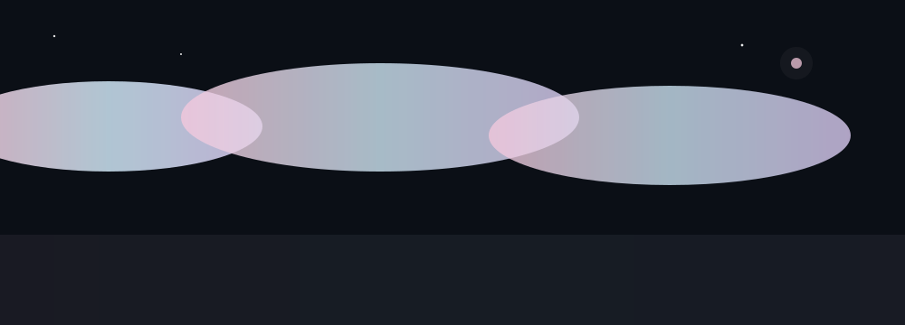
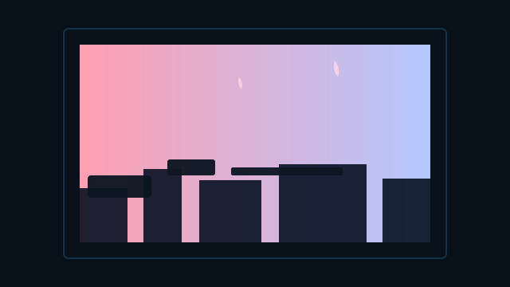

# 🚀 Shodhan Kumar Shetty

**Computer Science Engineer | Full-Stack Developer | Android Developer | AI Enthusiast**

---

### 📊 **Portfolio Highlights**

🌐 **Live Portfolio:** [shodhan-portfolio.vercel.app](https://shodhan-portfolio.vercel.app)

📱 **Featured Projects:** 7+ | 🎓 **Certifications:** 7 | 🏆 **Research Publications:** 1 | 🛠️ **Tools:** 25+

---

## 🎯 Hero — Professional Headline

  

  

**Computer Science Engineer** — Android · Full‑Stack · AI

Aspiring Computer Science Engineer focused on building practical, production-ready applications with modern architecture and AI-powered features.

---

## 🔥 Visuals — High-quality Aesthetic Motion

  

  

  

---

## 🎨 Tech Stack & Skills — Visual Grid

### Programming Languages

  

  

### Languages & Platforms (badges)

    

### Android & Cloud

    

---

## 📄 Resume

Download my resume: [doc/resume.pdf](doc/resume.pdf)

---

## 🌐 Connect

  

---

> © 2024-2026 Shodhan Kumar Shetty. All rights reserved.
